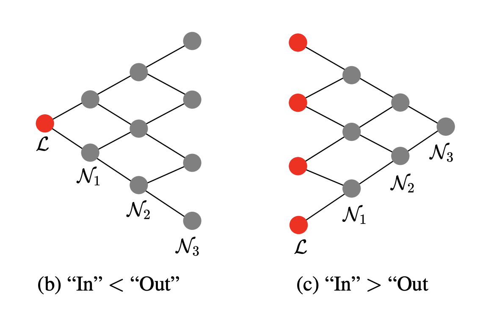
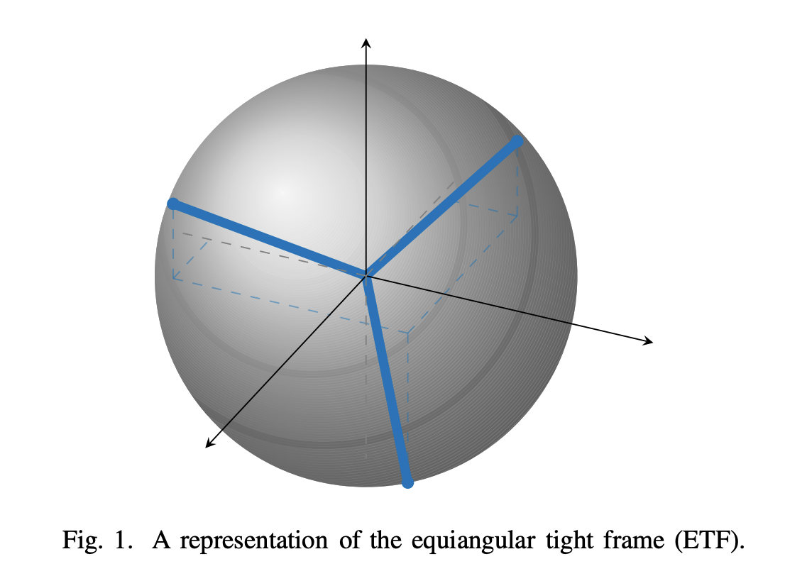
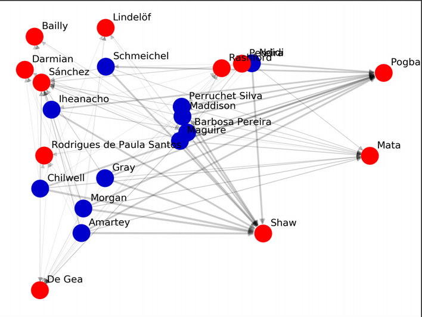

# About me 🖐
My name is Rattana Pukdee. I am a second year PhD student in the [Machine Learning Department](https://www.ml.cmu.edu/) at Carnegie Mellon University working with Prof. [Nina Balcan](http://www.cs.cmu.edu/~ninamf/) and Prof. [Pradeep Ravikumar](https://www.cs.cmu.edu/~pradeepr/). My research interests lie in the area of reliable machine learnning. I am particularly interested in the theoretical aspect of
- Learning with side information.  
- Robustness to adversarial attack and distribution shift  

Previously, I obtained a (4-year integrated) master degree in Mathematics from the [University of Oxford](https://www.maths.ox.ac.uk/).  
[Github](https://github.com/rattaoup) | [Linkedin](https://www.linkedin.com/in/rattana-pukdee/)

***

## News 📢
* **Oct 2021** I am joining Prof. [Nina Balcan](http://www.cs.cmu.edu/~ninamf/) and [Pradeep Ravikumar](https://www.cs.cmu.edu/~pradeepr/)'s lab at CMU.
* **Oct 2020** I am joining Prof. [Marco Mondelli](https://ist.ac.at/en/research/mondelli-group/)'s lab at IST Austria to work on theory of neural network pruning.

***

## Projects 💻

**Nash Equilibria and Pitfalls of Adversarial Training in Adversarial Robustness Games**  
Maria-Florina Balcan, Rattana Pukdee, Pradeep Ravikumar, Hongyang Zhang  
Accepted to AISTATS 2023  

**Label Propagation with Weak Supervision** 
Rattana Pukdee, Dylan Sam, Maria-Florina Balcan, Pradeep Ravikumar  
Accepted to ICLR 2023  

**Sharp asymptotics on the compression of two-layer neural networks** 
M.Amani, S.Bombari, M.Mondelli, R.Pukdee, S.Rini  
Accepted to ITW 2022  

**Improving Transformation Invariance in Contrastive Representation Learning** 
A.Foster, R.Pukdee, T.Rainforth  
Accepted to ICLR 2021  
[Github](https://github.com/ae-foster/invclr) | [Dataset](https://github.com/rattaoup/spirograph)  

**Predict Bitcoin prices by using Signature time series modelling**  
Summer research project supervised by Dr. Andrey Kormilitzin  

***

## Courseworks 🎓
1. **Hypergraphs projection method for community detections**  
Mini-project for C5.4 Network  

2. **Network Analysis in Team sports and Applications to English Premier League**  
Dissertation supervised by Dr. Ebrahim Patel  

3. **3-term Arithmetic Progressions** 
Extended essay supervised by Prof. Ben Green  

