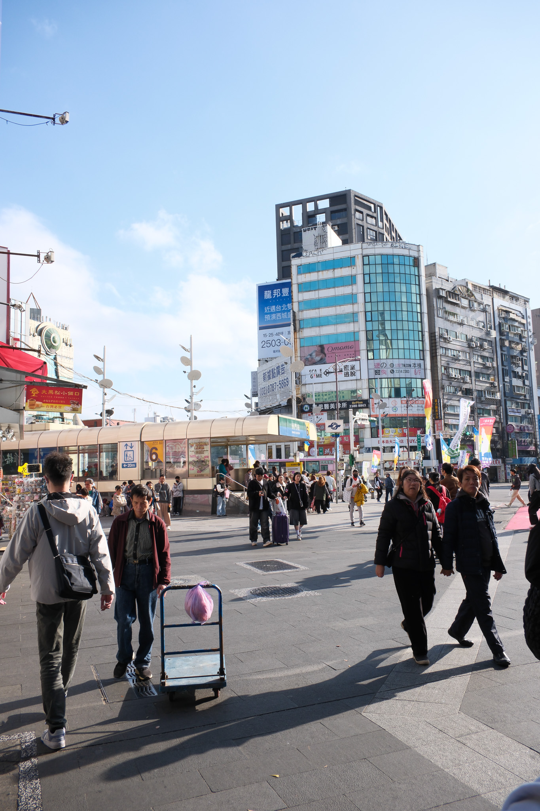

<!-- Africa
- [Marrakech](photography/marrakech.md) 

Central / South America
- [Cancun](photography/cancun.md)
- [Peru](photography/cusco.md)

Europe
- [Budapest](photography/budapest.md)
- [Vienna](photography/vienna.md)

North America
- [Pittsburgh](photography/pittsburgh.md)
- [New york](photography/newyork.md)
- [Las Vegas](photography/vegas.md)
- [Toronto](photography/toronto.md)
 -->

  

  <!-- Images -->
  
  
  
  
  
  
  
  
  
  
  
  
  
  
  
  
  
  

  <!-- Caption with arrows -->
  

    <button onclick="prevImage()">&#8592;</button>
    Marrakech
    <button onclick="nextImage()">&#8594;</button>
  

  

